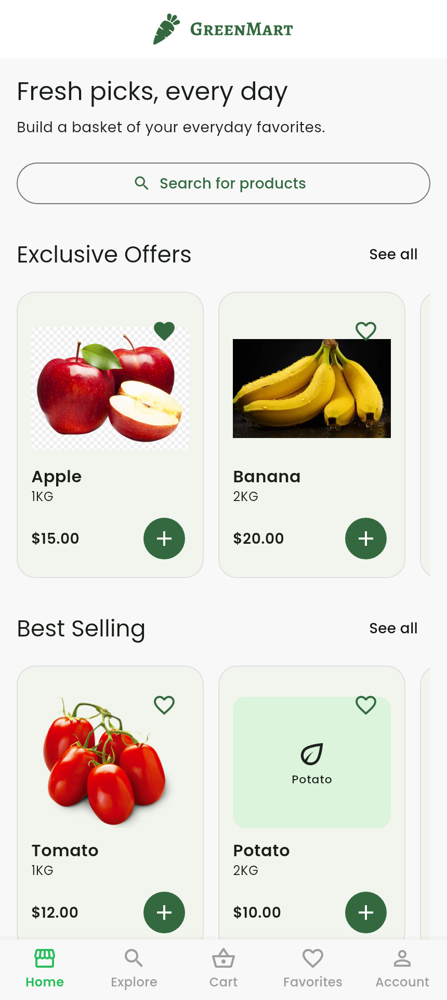
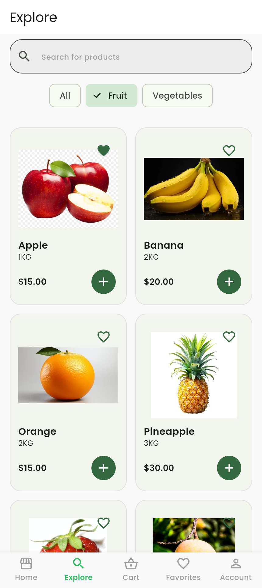
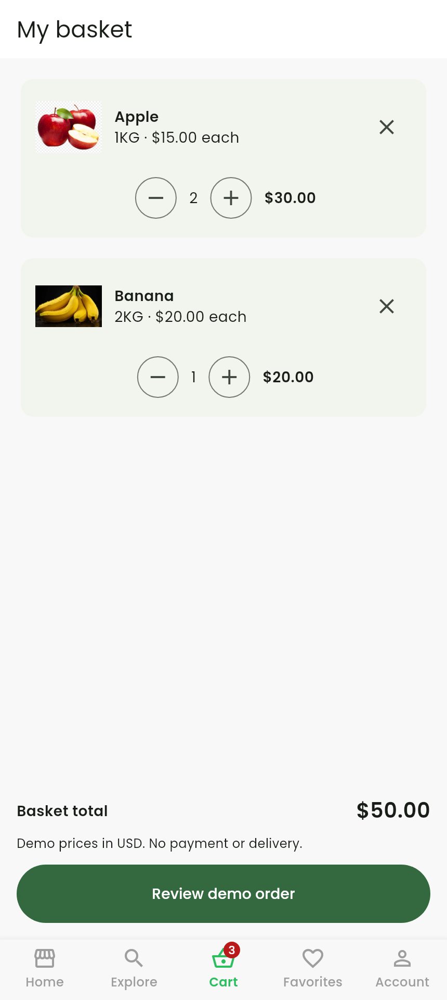

# GreenMart — Grocery Shopping Demo

A Flutter grocery app with a working local shopping flow: browse products, search by name or category, save favorites, build a basket, and review a demo order.

## Screenshots

Three screenshots captured directly from the running Flutter UI with bundled fonts and sample products. Click an image to see it at full size.

| Home | Explore & categories | Basket & quantities |
| :---: | :---: | :---: |
| [](docs/screenshots/01-home.png) | [](docs/screenshots/02-explore.png) | [](docs/screenshots/03-cart.png) |

## Features

- Responsive welcome screen, validated demo sign-in, and guest access.
- One catalog shared by Home, Explore, search, favorites, and the basket.
- Working **See all** links and case-insensitive search that trims extra spaces.
- Fruit and vegetable category filters, plus useful empty states.
- Add products, merge repeated additions, adjust quantities from 1–99, and remove items.
- Exact price totals calculated with integer cents; sample prices are shown in USD.
- Save and unsave favorites from any product list.
- Review a clearly labeled demo order, cancel it, or confirm it and receive a local reference.
- See the latest demo order in Account and leave the session.
- Bundled product images where available; labeled fallbacks for unavailable remote images.

## Demo scope

This is a frontend portfolio project. **There is no real authentication, payment processing, delivery service, or backend.** Demo sign-in accepts a validly formatted email and a sample password of at least six characters; it does not verify credentials or create an account. You can also continue as a guest.

Basket contents, favorites, and the latest demo order are held in memory. They survive navigation between tabs, but restarting the app or leaving the demo clears the session. No password is saved. A confirmed demo order clears the basket, preserves favorites, and never charges money or sends an actual order.

## Technologies

Flutter **3.38.10**, Dart, Material 3, `ChangeNotifier` for shared shopping state, `flutter_svg`, and bundled Poppins fonts. No backend setup or secret keys are needed.

## Run locally

```bash
git clone https://github.com/Mohamed-Ahmed984/GreenMart.git
cd GreenMart
flutter pub get
flutter run
```

Use `flutter run -d chrome` for the web version. Native builds require the corresponding Flutter platform tools. The project requires Dart `^3.10.7`; Flutter 3.38.10 is the version used by CI.

Some product photos still come from external hosts. Shopping remains usable if those photos are unavailable; the app shows a labeled fallback. Bundled image sources are listed in [`Assets/products/SOURCES.md`](Assets/products/SOURCES.md).

## Project structure

| Path | Responsibility |
| --- | --- |
| `lib/main.dart` | App entry point and theme |
| `lib/Core/Features/intro/` | Safe splash transition and responsive welcome screen |
| `lib/Core/Features/aut/page/` | Demo sign-in and guest access |
| `lib/Core/Features/main/` | Tabs, shared shopping session, and Account |
| `lib/Core/Features/home/` | Single product catalog, Home, and Explore/search |
| `lib/shopping/` | Basket/favorites state, product cards, totals, and demo checkout |
| `test/` | Navigation, shopping logic, and UI regression tests |
| `tool/capture_screenshots_test.dart` | Reproduce the three README screenshots |

## Validation

```bash
flutter analyze
flutter test
flutter build web --release
```

Tests cover navigation, invalid login inputs, guest entry, search/category filtering, duplicate additions, quantity limits, integer totals, favorites, order snapshots, checkout cancellation, empty states, and narrow-screen workflows. GitHub Actions validates the project from a fresh checkout.

To refresh the screenshot gallery:

```bash
flutter test tool/capture_screenshots_test.dart
```

Native Android/iOS device behavior still needs testing on the devices you intend to support.

## Development branches

- `fix/navigation-and-sign-in` — onboarding, form behavior, safe navigation, and analyzer cleanup.
- `fix/cart-and-catalog` — shared catalog, search, favorites, quantities, totals, and demo checkout.
- `docs/validation-and-screenshots` — edge-case checks, documentation, CI cleanup, and this three-image gallery.
